#  PROJECT OVERVIEW

This project was developed as part of a course on data-driven decision making, with a focus on building scalable analytics workflows using modern data tools and architectures. The goal is to simulate a real-world business scenario where raw operational data must be transformed into actionable insights through a structured pipeline.
The project emphasizes key concepts in:

- ETL (Extract, Transform, Load): Designing repeatable data ingestion and transformation flows
- Data Warehousing: Structuring data for efficient querying and historical analysis
- OLAP (Online Analytical Processing): Enabling multidimensional analysis for strategic decision support
- Power BI: Visualizing KPIs and trends to inform business stakeholders
- Apache Spark (optional): Exploring distributed data processing for large-scale transformation tasks

It introduces reproducible environment management using uv, ensuring consistency across development and deployment.

- Additional information: <https://github.com/kekkoq/smart-store-keiko>
- Project organization: [STRUCTURE](./STRUCTURE.md)
- Build professional skills:
  - **Environment Management**: Every project in isolation
  - **Code Quality**: Automated checks for fewer bugs
  - **Documentation**: Use modern project documentation tools
  - **Testing**: Prove your code works
  - **Version Control**: Collaborate professionally

---

## WORKFLOW 1. Set Up Your Machine

- [SET UP MACHINE](./SET_UP_MACHINE.md)

---

## WORKFLOW 2. Set Up Your Project

After verifying your machine is set up, set up a new Python project by copying this template.
Complete each step in the following guide.

- [SET UP PROJECT](./SET_UP_PROJECT.md)

It includes the critical commands to set up your local environment (and activate it):

```shell
uv venv
uv python pin 3.12
uv sync --extra dev --extra docs --upgrade
uv run pre-commit install
uv run python --version
```

**Windows (PowerShell):**

```shell
.\.venv\Scripts\activate
```

## WORKFLOW 3. Daily Workflow

Please ensure that the prior steps have been verified before continuing.
When working on a project, we open just that project in VS Code.

### 3.1 Git Pull from GitHub

Always start with `git pull` to check for any changes made to the GitHub repo.

```shell
git pull
```

### 3.2 Run Checks as You Work

This mirrors real work where we typically:

1. Update dependencies (for security and compatibility).
2. Clean unused cached packages to free space.
3. Clean up old log files to prevent clutter and keep recent context.
4. Use `git add .` to stage all changes.
5. Run ruff and fix minor issues.
6. Update pre-commit periodically.
7. Run pre-commit quality checks on all code files (**twice if needed**, the first pass may fix things).
8. Run tests.

In VS Code, open your repository, then open a terminal (Terminal / New Terminal) and run the following commands one at a time to check the code.

```shell
uv sync --extra dev --extra docs --upgrade
uv cache clean
uv run python scripts/cleanup_log.py
git add .
uvx ruff check --fix
uvx pre-commit autoupdate
uv run pre-commit run --all-files
git add .
uv run pytest
```

NOTE: The second `git add .` ensures any automatic fixes made by Ruff or pre-commit are included before testing or committing.

> **Log Cleanup:** `cleanup_log.py` deletes `.log` files older than 7 days. It helps keep the project tidy without losing recent logs.

<details>
<summary>Click to see a note on best practices</summary>

`uvx` runs the latest version of a tool in an isolated cache, outside the virtual environment.
This keeps the project light and simple, but behavior can change when the tool updates.
For fully reproducible results, or when you need to use the local `.venv`, use `uv run` instead.

</details>

### 3.3 Run the Data Preparation Script

To execute the data preparation module with relative imports, run the script as part of the package using the -m flag:
python -m src.analytics_project.data_prep

This tells Python to treat the folder as a package, enabling relative imports like:
from analytics_project.utils.logger import init_logger

Tip: Avoid running the script directly like this:
python src/analytics_project/data_prep.py


Doing so may result in:
ImportError: attempted relative import with no known parent package

Always use -m for package-aware execution.

### 3.4 Build Project Documentation

Make sure you have current doc dependencies, then build your docs, fix any errors, and serve them locally to test.

```shell
uv run mkdocs build --strict
uv run mkdocs serve
```

- After running the serve command, the local URL of the docs will be provided. To open the site, press **CTRL and click** the provided link (at the same time) to view the documentation. On a Mac, use **CMD and click**.
- Press **CTRL c** (at the same time) to stop the hosting process.

### 3.5 Execute

This project includes demo code.
Run the demo Python modules to confirm everything is working.

In VS Code terminal, run:

```shell
uv run python -m analytics_project.demo_module_basics
uv run python -m analytics_project.demo_module_languages
uv run python -m analytics_project.demo_module_stats
uv run python -m analytics_project.demo_module_viz
```

You should see:

- Log messages in the terminal
- Greetings in several languages
- Simple statistics
- A chart window open (close the chart window to continue).

If this works, your project is ready! If not, check:

- Are you in the right folder? (All terminal commands are to be run from the root project folder.)
- Did you run the full `uv sync --extra dev --extra docs --upgrade` command?
- Are there any error messages? (ask for help with the exact error)

---

### 3.6 Git add-commit-push to GitHub

Anytime we make working changes to code is a good time to git add-commit-push to GitHub.

1. Stage your changes with git add.
2. Commit your changes with a useful message in quotes.
3. Push your work to GitHub.

```shell
git add .
git commit -m "describe your change in quotes"
git push -u origin main
```

This will trigger the GitHub Actions workflow and publish your documentation via GitHub Pages.

### 3.7 Modify and Debug

With a working version safe in GitHub, start making changes to the code.

Before starting a new session, remember to do a `git pull` and keep your tools updated.

Each time forward progress is made, remember to git add-commit-push.

1. Environmental Setup:

  If .venv is deleted.
  adding a new package.
  creating a new project.

uv venv
uv pip install -r requirements.txt

2. Running Python:

   uv run python -m analytics_project.<module_name>

3. Running test:

$env:PYTHONPATH = "$PWD/src"
pytest --cov=src --cov-report=term-missing

### 3.8 Logger Path Mapping
Project Tree:


How the Import Works
- logger module lives in:
src/analytics_project/utils/logger.py
- Because analytics_project is a Python package (thanks to __init__.py), I import it like this:
from analytics_project.utils.logger import init_logger, logger, project_root
- This path means:
- analytics_project → my main package under src/
- utils → the subpackage containing utility functions
- logger → the actual file (logger.py) that defines init_logger, logger, and project_root
Why This Mapping Is Correct
- Separation of concerns: utils/logger.py is reusable across all modules (etl_to_dw.py, cubing.py, etc.).
- Consistency: All scripts import from the same path (analytics_project.utils.logger), so you don’t have conflicting imports like utils_logger.
- Flexibility: If you add more utilities later (e.g., validators.py, scrubbers.py), they’ll live alongside logger.py in the utils/ folder.

### 3.9 Setup Challenges

1. Pytest Setup and Troubleshooting
During initial setup, pytest failed to discover and execute tests due to environment inconsistencies and import resolution issues. These were resolved through the following steps:
Fixes Applied
- Interpreter mismatch: Ensured the correct Python interpreter (analytics-project) was selected and activated
- Import errors: Standardized relative imports across modules and verified __init__.py presence in test directories
- Environment isolation: Created a dedicated virtual environment and installed dependencies via requirements.txt
- Test discovery: Renamed test files and functions to follow pytest conventions (test_*.py, def test_*)
- Path resolution: Used sys.path.append() in conftest.py to ensure test modules could locate source file

2. Status Bar Not Visible in VS Code
In some environments, the Visual Studio Code status bar may fail to appear even when:
- Zen Mode and Full Screen are disabled
- "workbench.statusBar.visible": true is set in settings.json
- The Python extension is installed and active
- A valid interpreter is selected via Python: Select Interpreter
This issue does not affect script execution. Python files can still be run via the terminal or notebook interface, and environment activation works as expected.

3. Jupyter Kernel Not Detected in VS Code
Issue Summary
After migrating to a new machine, the Jupyter notebook interface in VS Code failed to detect the registered Python kernel from the project’s virtual environment (.venv). Despite the environment being correctly set up and ipykernel installed, the kernel picker showed no valid options, and notebook cells could not be executed.
Environment
- Windows 11
- VS Code (latest version)
- Python 3.12.12
- Virtual environment: .venv in project root
- Required packages installed: ipykernel, pandas, etc.
Symptoms
- Kernel picker shows “No Kernel” or only “Python Environments…”
- Jupyter: Clear Jupyter Server URI Storage command not available
- Notebook cells do not run
- Reinstalling Python and Jupyter extensions does not resolve the issue
Resolution Steps
- Uninstall and reinstall the Python extension
- Open Extensions panel (Ctrl+Shift+X)
- Uninstall Python (Microsoft)
- Restart VS Code
- Reinstall Python extension
- Manually select interpreter for notebook
- Open notebook (.ipynb)
- Click kernel picker → choose:
---

## P3: Data Cleaning with DataScrubber

### 3.1 Data Scrubber Workflow

This project includes a modular data cleaning pipeline using the DataScrubber class, located in
`src/analytics_project/data_preparation/data_scrubber.py`. The DataScrubber provides reusable
cleaning operations that are used by specialized preparation scripts for each data type.

Data Preparation Scripts:
- `prepare_customers_data.py`: Cleans and standardizes customer information
- `prepare_products_data.py`: Processes product catalog data
- `prepare_sales_data.py`: Handles transaction records

Each script can be run independently to process its specific dataset. The scripts:
1. Read raw data from `data/raw/`
2. Apply standardized cleaning steps using DataScrubber:
   - Standardize column names
   - Remove duplicates
   - Handle missing values
   - Apply domain-specific standardization
   - Validate data types and ranges
3. Save cleaned outputs to `data/prepared/`

Schema-Aware Scrubbing
   - Foreign key fields like store_id, campaign_id, and customer_id are validated and coerced to integer types to ensure join safety.
   - campaign_id = 0 is explicitly preserved to represent organic sales (not tied to a campaign).

To run a data preparation script, use the Python module syntax:

```powershell
# From the repository root:
.\.venv\Scripts\python.exe -m analytics_project.data_preparation.prepare_customers_data
.\.venv\Scripts\python.exe -m analytics_project.data_preparation.prepare_products_data
.\.venv\Scripts\python.exe -m analytics_project.data_preparation.prepare_sales_data
```

The cleaned datasets will be saved as:
- `data/prepared/customers_prepared.csv`
- `data/prepared/products_prepared.csv`
- `data/prepared/sales_prepared.csv`

Note: The `DataScrubber` class is a reusable library module that provides the core cleaning
functionality. It is not meant to be run directly but is imported by the preparation scripts.

### 3.2 Data Scrubbing Utilities

This project includes a set of reusable scrubbing methods for cleaning and standardizing datasets before analysis. These methods handle common issues such as inconsistent column names, duplicates, missing values, outliers, invalid dates, and more.

See below for available methods:

Method → Purpose
- standardize_column_names → Converts camelCase or spaced column names into snake_case.
- standardize_categorical_column → Strips whitespace and applies title‑case to categorical values (e.g., "east" → "East").
- remove_duplicate_records → Removes duplicate rows; optionally checks duplicates only on specified columns.
- handle_missing_data → Handles missing values by dropping rows or filling with a specified value.
- format_column_strings → Trims whitespace and enforces casing (lower or upper) in a given column.
- rename_columns → Renames columns using a provided dictionary of old → new names.
- reorder_columns → Reorders DataFrame columns based on a specified list.
- filter_outliers → Removes rows where values fall outside numeric bounds.
- convert_column_type → Converts a column to a specified data type (e.g., int, float, str).
- parse_date_column → Parses a column as datetime and stores the result in a new column.
- remove_negative_values → Removes rows where the specified column contains negative values.
- convert_empty_strings_to_na → Converts empty strings into missing values (NaN).
- override_invalid_dates → Replaces invalid or missing dates with a fixed default date.
---

## P4 ETL Design Overview

This project implements a modular ETL pipeline to transform raw retail data into a structured SQLite data warehouse for downstream analytics. The design emphasizes schema integrity, reproducibility, and SQL join practice using mock reference tables.

### 4.1 Data Warehousing

Original Raw Schema
The raw data files contained rich transactional and entity-level information. Below is a summary of the original columns before transformation:


### 4.2 ETL Transformations

During the ETL process, several columns were removed or transformed to align with the simplified schema and support SQL join practice:

🔻 Removed Columns
  - name from customer — excluded to focus on regional and behavioral attributes
  - stock_level and supplier_tier from product — excluded to simplify product modeling
  - payment_method from sale — excluded to streamline the sales table for campaign analysis
🔺 Added Mock Tables
    To support SQL join practice and campaign attribution analysis, two mock reference tables were added

These tables were populated at the execution of the ETL process.

  Table: sale
  - sale_id
  - customer_id
  - product_id
  - store_id
  - campaign_id
  - sale_amount
  - sale_date
  - discount_percent

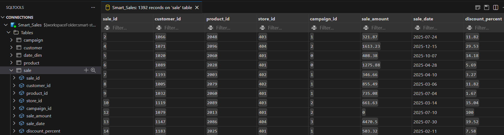

Table: customer
  - customer_id
  - region
  - join_date
  - loyalty_points
  - engagement_style

Table: product
  - product_id
  - product_name
  - category
  - unit_price

Table: store
  - store_id
  - store_name
  - region

Table: campaign
  - campaign_id
  - campaign_name
  - start_date
  - end_date

### 4.3 SQL Query example

```
  In a py file:
  import sqlite3
  import pandas as pd

  # Connect to the database
  conn = sqlite3.connect("data/dw/smart_sales.db")

  # SQL query
  query = """
  SELECT
      st.region,
      st.store_name,
      SUM(sa.sale_amount) AS total_sales
  FROM
      sale AS sa
  JOIN
      store AS st
      ON sa.store_id = st.store_id
  GROUP BY
      st.region, st.store_id
  ORDER BY
      st.region, total_sales DESC
  """
  # Run the query and load into a DataFrame
  df = pd.read_sql_query(query, conn)
  print(df)
  ```

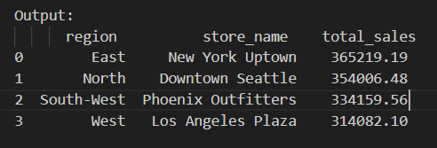

#### 4.5 ETL Highlights

- Schema Alignment: All foreign key fields were validated and coerced to integer types (Int64) to ensure join safety.
- Date Randomization: sale_date values were randomized across a 6-month range to simulate temporal variation.
- Selective Column Retention: Only analytics-relevant fields were retained to simplify schema and focus on campaign/store joins.

### 4.6 SQLite Extension Limitation in VS Code

Despite reinstalling the SQLite extension in Visual Studio Code, the expected interface features — such as the "Open Database" option in right-click context menu — did not appear. This prevented direct interaction with .db files through the extension UI.
As a workaround, all SQL operations (including schema creation, data inspection, and joins) were executed using Python scripts via sqlite3 and pandas. This approach ensured full control over database interactions and reproducibility across environments.

Workaround Strategy:
- SQL queries are embedded in Python scripts using cursor.execute() or pd.read_sql_query()
  - SQL Scripts are written in /dw_create/smart_sales_analysis.py.
- Data validation and joins are tested using Python-based queries instead of relying on extension-based exploration
This approach maintains full functionality and avoids reliance on potentially unstable IDE extensions.

---

## P5 Power BI Integration - Dashboard Creation and Analysis

### 5.1 Connecting the Database

- The smart_sales.db SQLite warehouse was connected to Power BI using an ODBC driver.
- This allowed direct access to the fact (sale) and dimension tables (store, campaign, customer, product) for analysis.

### 5.2 Writing SQL in Power Query

- Within Power Query, custom SQL queries were written to shape the data before loading into the model.
- Key queries included:
  - Total Sales by Company: aggregated sales across all stores.
  - Total Sales by Store: grouped sales by individual store for comparison.

### 5.3 Dashboards with OLAP Techniques

1. Using OLAP concepts (slicing, dicing, and drill-down), interactive dashboards were created:
  1. Total Sales by Month: trend analysis
  2. Total Sales by Customer Region and Campaign
  3. Top 5 Best-Selling Products by Year, Quarter, Month (Drill-Down)

2. Dashboard and Analysis

  1. Total Sales by Month: trend analysis

  - Sales fluctuate significantly, with a peak in July and a sharp drop in September, suggesting seasonal or campaign-driven  dynamics.
  - Benchmark lines (e.g., 151K, 114K, 88K) help contextualize performance thresholds — possibly representing targets, averages, or historical baselines.
  - Average sales: $113,956; hightest sales: $135,093 - can be used as a target line for next campaign; lowest sales: $92,492 - may require to investigate the causes.


  2. Total Sales by Customer Region and Campaign (Discount Bundle, Premium Upsell, Referral Incentives, Rewards Program)

   High-Level Insights:
   - Top-Performing Region:
   East leads across all campaigns, with sales ranging from 104K to 136K, indicating strong market penetration and campaign effectiveness.
   - Lowest-Performing Region:
   Central consistently shows the lowest sales across all campaigns (28K–44K), suggesting limited reach or lower campaign resonance.
   - Most Effective Campaign Overall:
   Referral Incentives performs best in the East (136K), and is consistently strong across regions, making it a high-impact strategy.

   Campaign Performance:
   - Referral Incentives is the most consistent top performer across lower-performing regions (North, West, South-West, South), suggesting it's a reliable baseline strategy.
   - Rewards Program excels in high-performing regions (East), but underperforms in South-West — possibly due to regional income or product-market fit.
   - Discount Bundle and Premium Upsell show moderate performance, with Discount Bundle outperforming Premium Upsell across most regions

3. Sales Performance by Campaign, Product, and Channel (Region-Filtered View)

  Product Sales:
  Home products lead with 0.40M in sales, significantly outperforming all other categories.
   - Highest sales in East region (151k)
   - Indicates strong regional demand or effective campaign targeting for home-related items.
   - May justify prioritizing inventory and promotions in this category.
   - Clothing and electronics show notably lower sales in West and South-West.
   - May reflect regional preferences, pricing sensitivity, or weaker campaign resonance.
   - Suggests need for localized marketing strategies or product mix adjustments in those regions.

  Channel Performance:
  - Mobile and desktop channels are increasingly popular, reflecting a broader shift from traditional in-store shopping to online engagement.
  -Central Region Exception: In-Store Still Dominant
   - In the Central region, in-store sales lead at 72K, outperforming mobile (55K) and desktop (12K).

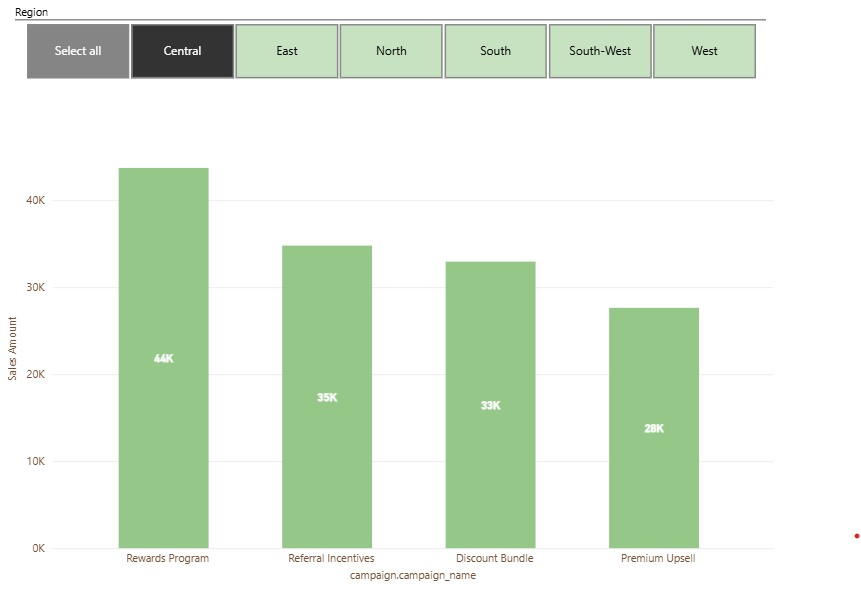

### 5.4 Challenges

During cube building and Power BI integration, inconsistencies were discovered in the prepared datasets:
- Some product_id values in the sale table did not exist in the product dimension.
- Some customer_id values in the sale table did not exist in the customer dimension.
- When merged, these mismatches resulted in Unknown/Undefined values in the cube and dashboards.
- To resolve this, corrective logic was implemented in the ETL pipeline script (etl-to-dw.py) to ensure data integrity prior to Power BI loading.
This highlighted the importance of data validation and integrity checks during ETL and before OLAP cubing.

---
## P6 BI Insights and Storytelling

### OLAP Project Workflow

### Section 1. The Business Goal

  Question:
  How effective is each sales campaign in delivering positive ROI?

  Why It Matters:
  - Identify which campaigns drive the most value.
  - Ensures marketing spend is justified with measurable sales outcomes.
  - Helps identify underperforming campaigns for reevaluation.
  - Creates benchmarks for designing future campaigns.
  - Supports better segmentation and resource allocation.
  - Align marketing strategy with inventory and supply chain planning.
  - Strengthens collaboration between marketing, finance, and operations for overall business growth goals.

### Section 2. Data Source

  - Starting Point:
  A Database file (smart_sales.db) was populated through the ETL pipeline to ensure data is cleaned, transformed, and structured for analysis.
  - Storage:
  Data was connected to a SQLite database for querying and integration with Power BI.
  - Columns Used in Cubing Script
    - Campaign: campaign_name, campaign_cost
    - Sale: sale_amount, sale_date
    - Customer: region
    - To merge dimension tables into sale table: product_id, customer_id

### Section 3. Tools

  I chose Python to create a cube, then the script was visualized in Power BI to support slicing, dicing and drill-down.

  Python scripts:
  1. cubing_campaign.py to perform drill-down in Power BI
  2. cubing_campaign_sql.py to validate the metrics used in Power BI
  3. top_three_products.py to perform dicing in Python-based visualization

  - This pre-computed file reduces complexity in DAX and supports efficient slicing and benchmarking in Power BI without overloading the model.
  - Python scripts provide reproducibility, modularity, and flexibility for both exploratory analysis and dashboard-ready outputs.

### Section 4. Workflow & Logic - cubing_campaign.py

  Filing Structure:

  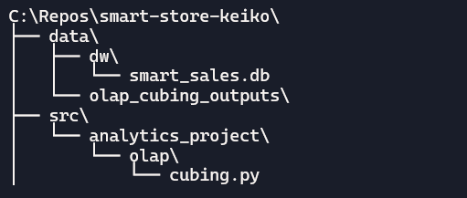

  1. Ingest Data
     - Connects to the SQLite data warehouse.
     - Loads sales plus dimension tables (store, campaign, product, customer).
     - Merges them into one enriched sales_df with all attributes attached.

  2. Prepare Dimensions & Metrics
     - Adds Year and Month columns from sale_date.
     - Defines dimensions (Year, Month, region, campaign_name, category).
     - Defines metrics (sale_amount: sum, sale_id: count, campaign_cost: first).

  3. Create OLAP Cube
     - Groups data by dimensions.
     - Aggregates metrics into a cube.
     - Calculates ROI measures:
       - Monthly ROI = (sales – monthly cost) ÷ monthly cost.
       - Cumulative ROI = (cumulative sales – campaign cost) ÷ campaign cost.
       - Overall ROI = (sales – campaign cost) ÷ campaign cost.
       - Adds cumulative sales tracking per campaign.

  4. Export Results
     - Writes the OLAP cube to campaign_effectiveness.csv.

### Section 5. Results

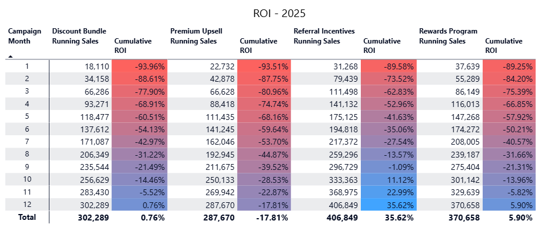

  Cumulative ROI Analysis (2025)

  Referral Incentives: Strongest ROI Performance (35.62%)
   - Starts negative but crosses into positive ROI by Month 9, ending at +35.6%.
   - Consistently high monthly sales (e.g., 48K in Month 2, 42K in Month 8).
   - Most efficient use of campaign cost ($300K), with highest cumulative sales (406K).
   - Indicates strong customer response and sustained momentum.

  Rewards Program:  ROI (5.9%)
   - Monthly sales fluctuate but peak in Month 12 (41K).
   - Suggests potential for long-term payoff.

  Discount Bundle: Breaks Even at Year-End (0.76%)
   - ROI turns positive only in Month 12
   - Monthly sales are moderate, with a peak in Month 7 (33K).
   - Cumulative sales: 302K, lowest among all campaigns.
   - Indicates limited efficiency — may need redesign or targeting adjustment.

  Premium Upsell: ROI (-17.8%)
   - ROI remains negative throughout 2025.
   - Despite decent cumulative sales (287K), campaign cost is higher ($350K).
   - Monthly sales are inconsistent, with a spike in Month 10 (38K) but weak throughout the year.
   - likely needs reevaluation or repositioning.

  Top 3 Best-Selling Products by units per store (Python visualization only)

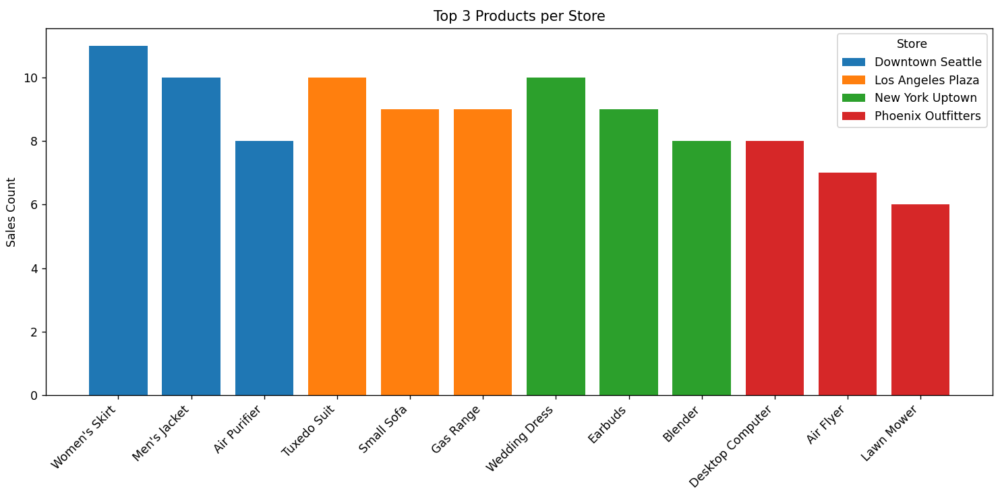

  Store-Level Insights:

  Downtown Seattle:
  - Top Product: Women’s skirt, Men’s Jacket, Air Purifier.
  - Prioritize inventory for apparel. consider bundling women's clothing with accessories.

  Los Angeles Plaza:
  - Top Products: Tuxedo Suit, Small Sofa, Gas Range.
  - Optimize layout to showcase both fashion and home sections.

  New York Uptown:
  - Top Products: Wedding Dress, Earbuds, Blender.
  - Strengthen segmenting by category.

  Phoenix Outfitters:
  - Top Products: Desktop Computer, Air Fryer, Lawn Mower.
  - Consider seasonal campaigns (e.g., spring gardening, holiday tech deals).

  Top 5 Best-Selling Products - revenue drivers by Year, Quarter, Month (Drilldown)

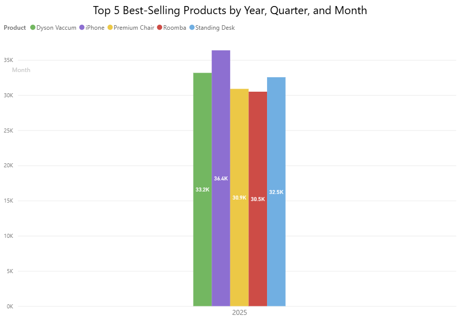

  Key Insights:
   - iPhone Leads with 36.4K units sold in 2025. The iPhone is the clear top seller.
     - Indicates strong launch or renewal cycles early.
     - Its margin over the second-place Dyson Vacuum (3.2K units) suggests strong brand loyalty and seasonal demand.
   - Dyson Vacuum - after a modest Q1 and Q2, peaking at 11K in Q4.
     - This pattern may reflect holiday season demand.
   - Roomba sales ranged from 7.6k to 10.2k from Q1 to Q3 and dropped sharply to 4.5k in Q4.
     - This warrants investigation into potential inventory constraints or supply chain issues.
   - Premium Chair’s with 15K units sold, Q2 was its strongest quarter — nearly double its Q1 and Q3 performance.
     - Suggests possibly tied to home office upgrades or summer sales.
   - Standing Desk shows steady sales in Q1 to Q4, underperforming in Q2 and Q3.
     - This may be liked to consumer's priority shift or inventory lag.

### Section 6: Suggested Business Action

  1. Referral Incentives:
     - Expand this campaign into new customer demographics since it shows strong performance.
  2. Rewards Program:
     - Conduct a survey or focus group to understand what drives fluctuations especially (18K) in February and (41k) in December.
  3. Discount Bundle:
     - Redesign discount structure and promote high-demand products.
  4. Premium Upsell:
     - Investigate persistent underperformance
     - Review cost structure - marketing spend is too high?
     - Run customer surveys to obtain customer insights on this campaign.

### Section 7. Challenges

  - Despite earlier remediation efforts, the dataset still contained invalid and missing values.
  - To facilitate the analysis, I replaced several nonsensical product names with recognizable items (e.g., Dyson Vacuum, iPhone).
  - The Python campaign cubing script turned out to be incomplete. While building a visualization in Power BI, I discovered missing components that limited its ability to fully support the analysis. This required DAX Calculations in Power BI.
  - These measures allowed me to perform detail analysis such as campaign ROI variance and monthly sales comparisons.

---
## P7 Finalized BI Project

### Section 1. The Business Goal

Evaluate how effective each sales campaign is in delivering positive ROI. This ensures marketing spend is justified, highlights underperforming campaigns, creates benchmarks for future planning, supports segmentation and resource allocation, and aligns marketing with inventory, supply chain, and overall business growth.

### Section 2. Data Source

The project uses two complementary files. The first, smart_sales.db, is a SQLite database populated through the ETL pipeline and containing individual tables such as sale, product, and campaign. This structured warehouse ensures data is cleaned, validated, and query‑ready. The second file, campaign_effectiveness.csv, was generated through the Python pipeline by merging these dimension tables with the sales data and extracting only the necessary columns. This consolidated dataset facilitates campaign‑focused analysis and serves as the input for Power BI visualization.

### Section 3. Tools Used

In this project, Python scripts were employed to pre‑compute OLAP cubes, perform drill‑down and dicing operations, and ensure reproducibility and modularity in the analysis. The data was stored in SQLite (smart_sales.db), which served as the structured warehouse for querying, validation, and the creation of additional tables to support integration with Power BI. Finally, Power BI was used as the visualization layer, enabling interactive slicing, dicing, and drill‑down for stakeholders while reducing complexity in DAX by leveraging the pre‑computed outputs.

### Section 4. Workflow & Logic

The pipeline connects to smart_sales.db via ODBC, ingesting sales and dimension tables. Data is enriched with time attributes and merged into a unified dataset. Python scripts then build an OLAP cube, grouping by campaign, region, and time, and calculating ROI metrics (monthly, cumulative, overall). The cube is exported as campaign_effectiveness.csv, which is connected to Power BI for interactive slicing, dicing, and benchmarking.

### Section 5. Results (visualizations + narrative)

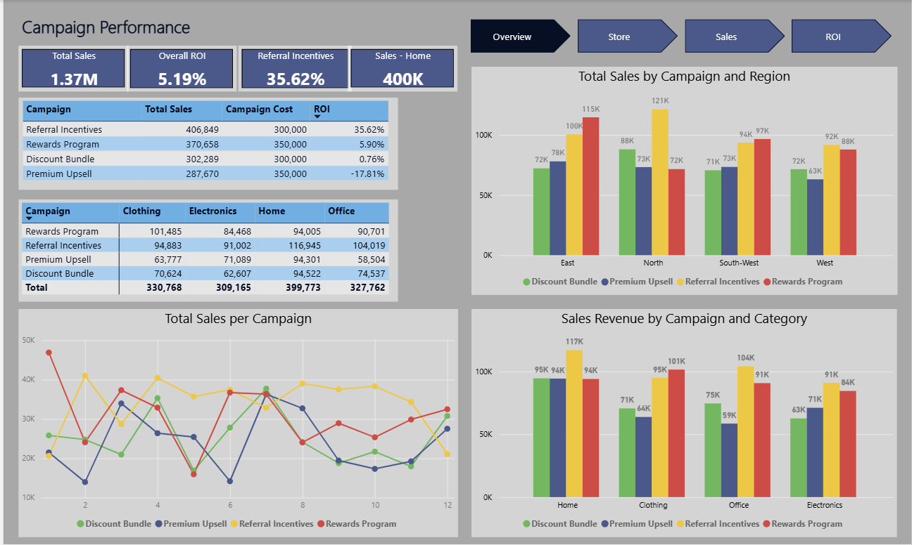
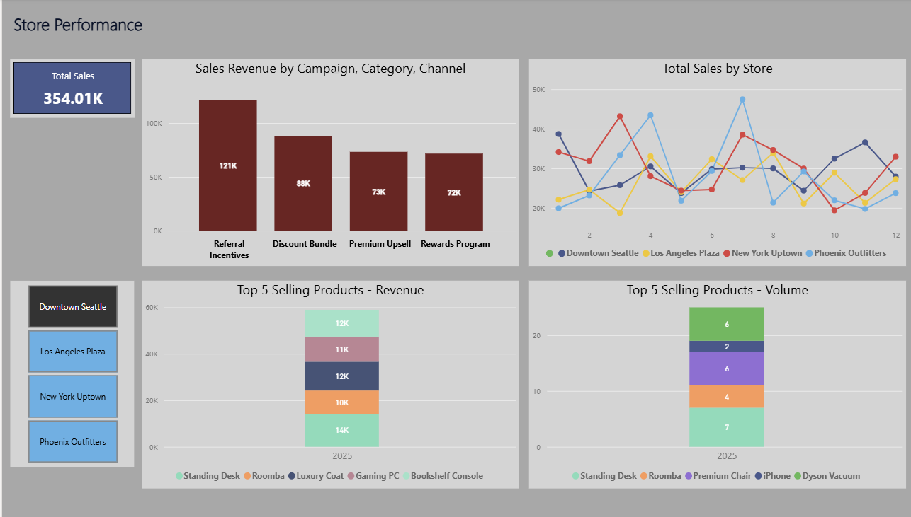
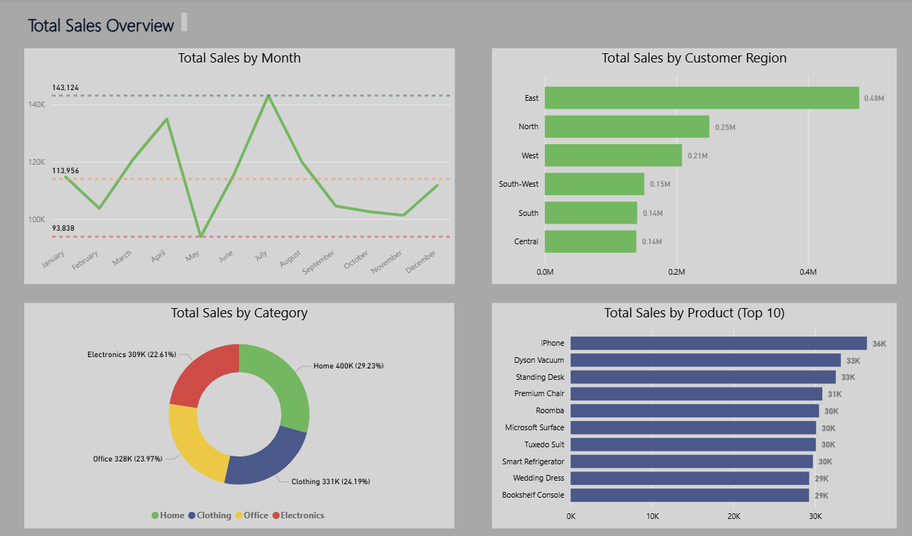
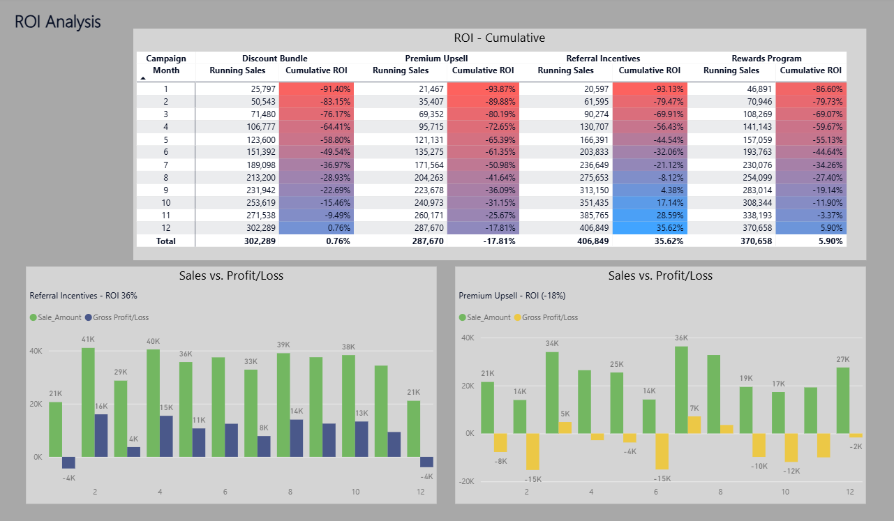

The dashboard focuses on sales performance across four campaigns: Discount Bundle, Premium Upsell, Referral Incentives, and Rewards Program for 2025. The Total ROI across all campaigns is 5.19%, indicating modest overall efficiency.

- Strong ROI Leaders: Referral Incentives campaign program shows high ROI (35.7%), indicating highly efficient spend-to-sales conversion. These campaigns are prime candidates for scaling or replication.
- Underperformer Identified: Premium Upsell shows a negative ROI (-17.81%). Every month shows a negative gross profit, ranging from (-1K) to (-15K), suggesting misalignment between campaign cost and sales impact. This warrants reevaluation or redesign.
- Rewards Program campaign shows a modest but positive ROI of 5.9% over the year.
- Discount Bundle campaign hovers around the breakeven point, with a cumulative ROI of 0.76% over the year
- Referral Incentives generated the highest sales across all categories — Home, Electronics, Clothing, and Office — consistently outperforming other campaigns. Rewards Program followed as the second-strongest contributor in each category.
- The home products are the primary driver of sales revenue across all campaigns.
- Regional Performance Highlights:
  - In the East, Rewards Program performed highest (115K), with Referral Incentives also showing strength (100K).
  - In the North, Referral Incentives again led (121K),
  - In the South-West, Rewards Program topped the region (97K), slightly ahead of Referral Incentives (94K).
  - In the West, Referral Incentives was the strongest performer (92K), while Rewards Program maintained solid traction (88K).

Sales revenue and store performance highlights:
- Store Performance: New York Uptown store is the top contributor to total sales, signaling strong market engagement in those areas. Regional targeting strategies may benefit from deeper segmentation here.
- Product Impact: High-performing products such as Standing Desk, Dyson Vacuum, and iPhone dominate sales revenue, reinforcing their role as key drivers across campaigns. These should be prioritized in future bundles or promotions.
- Temporal Trends: The line graph of monthly sales reveals fluctuations that may align with campaign launches or seasonal effects. This insight can guide timing strategies for future campaigns.
- Dyson Vacuum and iPhone lead significantly in both sales revenue and unit volume.

### Section 6. Suggested Business Action

- Scale Referral Incentives: With a standout ROI of 35.7% and category-leading sales, this campaign is a prime candidate for expansion across more regions and product lines. Consider replicating its structure in underperforming areas or pairing it with high-impact products like Dyson Vacuum and iPhone.
- Redesign Premium Upsell: The negative ROI (–17.81%) suggests poor cost-to-impact efficiency. Conduct a cost audit, reassess product positioning, and explore alternative upsell triggers (e.g., bundling with high-conversion items or targeting different customer segments).
- Optimize Rewards Program: With a modest but positive ROI (5.9%) and consistent regional traction, this campaign is well-positioned for incremental improvements. Test enhanced reward tiers or seasonal boosts to lift engagement.
- Reevaluate Discount Bundle: Hovering near breakeven (0.76% ROI), this campaign may benefit from targeted reconfiguration — such as adjusting discount thresholds, bundling with top-selling products, or limiting rollout to high-performing regions.
- iPhone, Dyson Vacuum, and Standing Desk collectively drive over 100K in sales. These products should anchor future campaigns and receive priority in inventory planning to prevent stockouts and maximize ROI.

Regional & Store-Level Actions
- Prioritize East and North for Referral Incentives: These regions show strong alignment with the campaign’s value proposition. Consider doubling down on budget allocation, localized messaging, and influencer partnerships here.
- Leverage South-West for Rewards Program: With 97K in sales, this region responds well to loyalty-driven incentives. Explore region-specific perks or cross-promotions with local partners.
- Refine Segmentation in New York Uptown: As the top-performing store, this location warrants granular customer profiling and premium product testing. Use it as a pilot site for new bundles or campaign variants.

### Section 7. Challenges

- Data Limitations: The dataset lacked key fields (e.g., no sales quantity or product cost columns, discount percent not aligned with unit price), restricting deeper product‑level analysis such as gross profit ratio or discount impact.
- Scope Constraints: Because fixing the dataset would require starting over, analysis was limited to available fields rather than comprehensive modeling.
- Manual Adjustments: To improve realism, a handful of product names were manually changed. requiring extensive trial and error to find the most effective charts.
- Pipeline Gaps: The Python OLAP pipeline did not include all necessary elements, so missing components had to be compensated with custom DAX measures in Power BI.
- Unlike Excel or Tableau, Power BI visuals depend on model relationships and charts don't always behave intuitively,especially when dealing with non-additive metrics or complex filter contexts.. This was addressed by writing explicit DAX measures to define logic.

### Section 8. Ethical Considerations

- The underlying dataset is fictional thus insights may not fully represent real-world behavior.
- Manual changes and override to the raw data should be documented.
- Avoid overstating findings - ensure that visualizations don’t unintentionally bias interpretation.
- Underperforming campaigns (like Premium Upsell) may reflect dataset constraints rather than true business inefficiency.
- Do not penalize strategies based on incomplete or synthetic data.
- Responsible Use of Analytics Tools.


