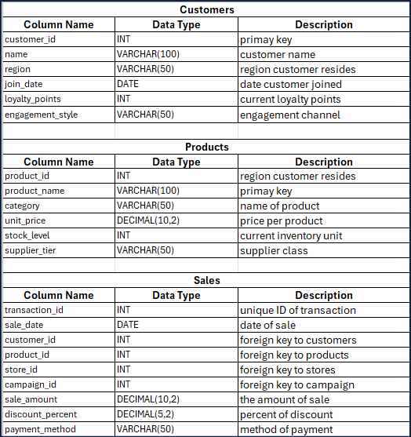
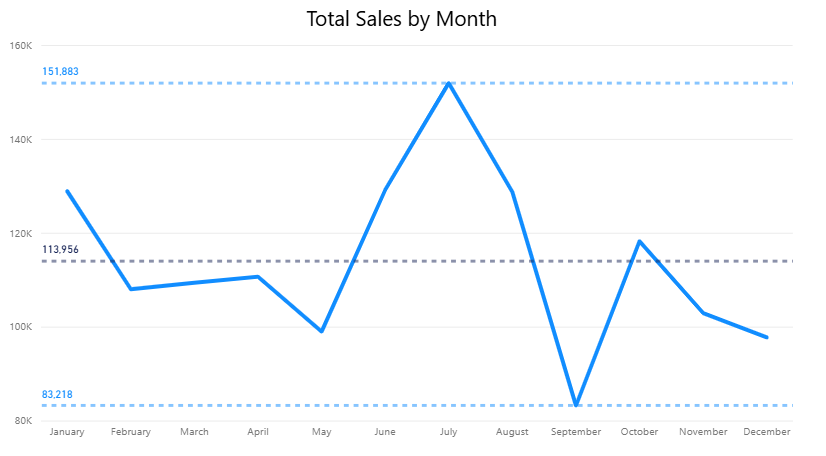
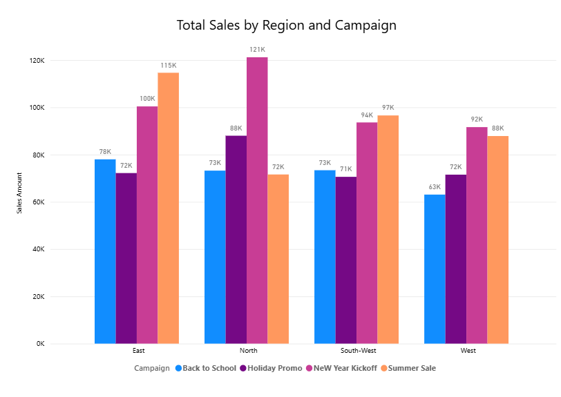
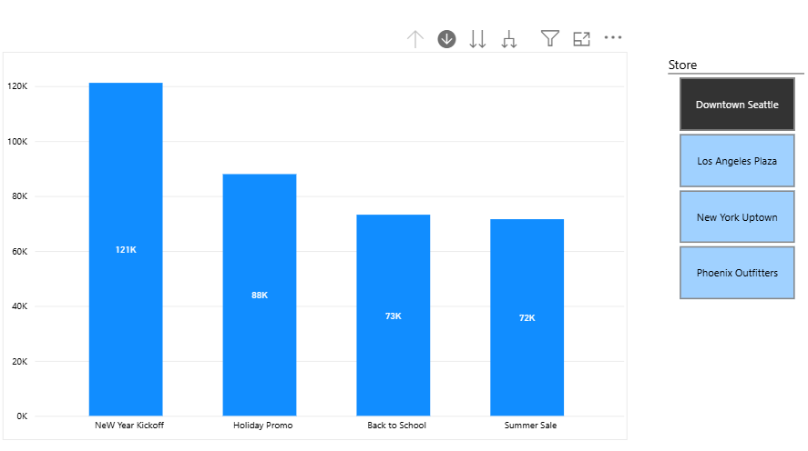

#  PROJECT OVERVIEW

This project was developed as part of a course on data-driven decision making, with a focus on building scalable analytics workflows using modern data tools and architectures. The goal is to simulate a real-world business scenario where raw operational data must be transformed into actionable insights through a structured pipeline.
The project emphasizes key concepts in:

- ETL (Extract, Transform, Load): Designing repeatable data ingestion and transformation flows
- Data Warehousing: Structuring data for efficient querying and historical analysis
- OLAP (Online Analytical Processing): Enabling multidimensional analysis for strategic decision support
- Power BI: Visualizing KPIs and trends to inform business stakeholders
- Apache Spark: Exploring distributed data processing for large-scale transformation tasks

It introduces reproducible environment management using uv, ensuring consistency across development and deployment.

- Additional information: <https://github.com/kekkoq/smart-store-keiko>
- Project organization: [STRUCTURE](./STRUCTURE.md)
- Build professional skills:
  - **Environment Management**: Every project in isolation
  - **Code Quality**: Automated checks for fewer bugs
  - **Documentation**: Use modern project documentation tools
  - **Testing**: Prove your code works
  - **Version Control**: Collaborate professionally

---

## WORKFLOW 1. Set Up Your Machine

Proper setup is critical.
Complete each step in the following guide and verify carefully.

- [SET UP MACHINE](./SET_UP_MACHINE.md)

---

## WORKFLOW 2. Set Up Your Project

After verifying your machine is set up, set up a new Python project by copying this template.
Complete each step in the following guide.

- [SET UP PROJECT](./SET_UP_PROJECT.md)

It includes the critical commands to set up your local environment (and activate it):

```shell
uv venv
uv python pin 3.12
uv sync --extra dev --extra docs --upgrade
uv run pre-commit install
uv run python --version
```

**Windows (PowerShell):**

```shell
.\.venv\Scripts\activate
```

**macOS / Linux / WSL:**

```shell
source .venv/bin/activate
```

---

## WORKFLOW 3. Daily Workflow

Please ensure that the prior steps have been verified before continuing.
When working on a project, we open just that project in VS Code.

### 3.1 Git Pull from GitHub

Always start with `git pull` to check for any changes made to the GitHub repo.

```shell
git pull
```

### 3.2 Run Checks as You Work

This mirrors real work where we typically:

1. Update dependencies (for security and compatibility).
2. Clean unused cached packages to free space.
3. Clean up old log files to prevent clutter and keep recent context.
4. Use `git add .` to stage all changes.
5. Run ruff and fix minor issues.
6. Update pre-commit periodically.
7. Run pre-commit quality checks on all code files (**twice if needed**, the first pass may fix things).
8. Run tests.

In VS Code, open your repository, then open a terminal (Terminal / New Terminal) and run the following commands one at a time to check the code.

```shell
uv sync --extra dev --extra docs --upgrade
uv cache clean
uv run python scripts/cleanup_log.py
git add .
uvx ruff check --fix
uvx pre-commit autoupdate
uv run pre-commit run --all-files
git add .
uv run pytest
```

NOTE: The second `git add .` ensures any automatic fixes made by Ruff or pre-commit are included before testing or committing.

> **Log Cleanup:** `cleanup_log.py` deletes `.log` files older than 7 days. It helps keep the project tidy without losing recent logs.

<details>
<summary>Click to see a note on best practices</summary>

`uvx` runs the latest version of a tool in an isolated cache, outside the virtual environment.
This keeps the project light and simple, but behavior can change when the tool updates.
For fully reproducible results, or when you need to use the local `.venv`, use `uv run` instead.

</details>

### 3.3 Run the Data Preparation Script

To execute the data preparation module with relative imports, run the script as part of the package using the -m flag:
python -m src.analytics_project.data_prep

This tells Python to treat the folder as a package, enabling relative imports like:
from .utils_logger import init_logger


Tip: Avoid running the script directly like this:
python src/analytics_project/data_prep.py


Doing so may result in:
ImportError: attempted relative import with no known parent package

Always use -m for package-aware execution.

### 3.4 Build Project Documentation

Make sure you have current doc dependencies, then build your docs, fix any errors, and serve them locally to test.

```shell
uv run mkdocs build --strict
uv run mkdocs serve
```

- After running the serve command, the local URL of the docs will be provided. To open the site, press **CTRL and click** the provided link (at the same time) to view the documentation. On a Mac, use **CMD and click**.
- Press **CTRL c** (at the same time) to stop the hosting process.

### 3.5 Execute

This project includes demo code.
Run the demo Python modules to confirm everything is working.

In VS Code terminal, run:

```shell
uv run python -m analytics_project.demo_module_basics
uv run python -m analytics_project.demo_module_languages
uv run python -m analytics_project.demo_module_stats
uv run python -m analytics_project.demo_module_viz
```

You should see:

- Log messages in the terminal
- Greetings in several languages
- Simple statistics
- A chart window open (close the chart window to continue).

If this works, your project is ready! If not, check:

- Are you in the right folder? (All terminal commands are to be run from the root project folder.)
- Did you run the full `uv sync --extra dev --extra docs --upgrade` command?
- Are there any error messages? (ask for help with the exact error)

---

### 3.6 Git add-commit-push to GitHub

Anytime we make working changes to code is a good time to git add-commit-push to GitHub.

1. Stage your changes with git add.
2. Commit your changes with a useful message in quotes.
3. Push your work to GitHub.

```shell
git add .
git commit -m "describe your change in quotes"
git push -u origin main
```

This will trigger the GitHub Actions workflow and publish your documentation via GitHub Pages.

### 3.7 Modify and Debug

With a working version safe in GitHub, start making changes to the code.

Before starting a new session, remember to do a `git pull` and keep your tools updated.

Each time forward progress is made, remember to git add-commit-push.

1. Environmental Setup:

  If .venv is deleted.
  adding a new package.
  creating a new project.

uv venv
uv pip install -r requirements.txt

2. Running Python:

   uv run python -m analytics_project.<module_name>

3. Running test:

$env:PYTHONPATH = "$PWD/src"
pytest --cov=src --cov-report=term-missing

### 3.8 Challenges

1. Pytest Setup and Troubleshooting
During initial setup, pytest failed to discover and execute tests due to environment inconsistencies and import resolution issues. These were resolved through the following steps:
✅ Fixes Applied
- Interpreter mismatch: Ensured the correct Python interpreter (analytics-project) was selected and activated
- Import errors: Standardized relative imports across modules and verified __init__.py presence in test directories
- Environment isolation: Created a dedicated virtual environment and installed dependencies via requirements.txt
- Test discovery: Renamed test files and functions to follow pytest conventions (test_*.py, def test_*)
- Path resolution: Used sys.path.append() in conftest.py to ensure test modules could locate source file

2. Status Bar Not Visible in VS Code
In some environments, the Visual Studio Code status bar may fail to appear even when:
- Zen Mode and Full Screen are disabled
- "workbench.statusBar.visible": true is set in settings.json
- The Python extension is installed and active
- A valid interpreter is selected via Python: Select Interpreter
This issue does not affect script execution. Python files can still be run via the terminal or notebook interface, and environment activation works as expected.

3. Jupyter Kernel Not Detected in VS Code
Issue Summary
After migrating to a new machine, the Jupyter notebook interface in VS Code failed to detect the registered Python kernel from the project’s virtual environment (.venv). Despite the environment being correctly set up and ipykernel installed, the kernel picker showed no valid options, and notebook cells could not be executed.
Environment
- Windows 11
- VS Code (latest version)
- Python 3.12.12
- Virtual environment: .venv in project root
- Required packages installed: ipykernel, pandas, etc.
Symptoms
- Kernel picker shows “No Kernel” or only “Python Environments…”
- Jupyter: Clear Jupyter Server URI Storage command not available
- Notebook cells do not run
- Reinstalling Python and Jupyter extensions does not resolve the issue
Resolution Steps
- Uninstall and reinstall the Python extension
- Open Extensions panel (Ctrl+Shift+X)
- Uninstall Python (Microsoft)
- Restart VS Code
- Reinstall Python extension
- Manually select interpreter for notebook
- Open notebook (.ipynb)
- Click kernel picker → choose:

## 4.1 Data Cleaning with DataScrubber

This project includes a modular data cleaning pipeline using the DataScrubber class, located in
`src/analytics_project/data_preparation/data_scrubber.py`. The DataScrubber provides reusable
cleaning operations that are used by specialized preparation scripts for each data type.

Data Preparation Scripts:
- `prepare_customers_data.py`: Cleans and standardizes customer information
- `prepare_products_data.py`: Processes product catalog data
- `prepare_sales_data.py`: Handles transaction records

Each script can be run independently to process its specific dataset. The scripts:
1. Read raw data from `data/raw/`
2. Apply standardized cleaning steps using DataScrubber:
   - Standardize column names
   - Remove duplicates
   - Handle missing values
   - Apply domain-specific standardization
   - Validate data types and ranges
3. Save cleaned outputs to `data/prepared/`

Schema-Aware Scrubbing
   - Foreign key fields like store_id, campaign_id, and customer_id are validated and coerced to integer types to ensure join safety.
   - campaign_id = 0 is explicitly preserved to represent organic sales (not tied to a campaign).

To run a data preparation script, use the Python module syntax:

```powershell
# From the repository root:
.\.venv\Scripts\python.exe -m analytics_project.data_preparation.prepare_customers_data
.\.venv\Scripts\python.exe -m analytics_project.data_preparation.prepare_products_data
.\.venv\Scripts\python.exe -m analytics_project.data_preparation.prepare_sales_data
```

The cleaned datasets will be saved as:
- `data/prepared/customers_prepared.csv`
- `data/prepared/products_prepared.csv`
- `data/prepared/sales_prepared.csv`

Note: The `DataScrubber` class is a reusable library module that provides the core cleaning
functionality. It is not meant to be run directly but is imported by the preparation scripts.


## 5 ETL Design Overview

This project implements a modular ETL pipeline to transform raw retail data into a structured SQLite data warehouse for downstream analytics. The design emphasizes schema integrity, reproducibility, and SQL join practice using mock reference tables.

#### 5.1 Original Raw Schema

The raw data files contained rich transactional and entity-level information. Below is a summary of the original columns before transformation:



### 5.2 ETL Transformations

During the ETL process, several columns were removed or transformed to align with the simplified schema and support SQL join practice:

🔻 Removed Columns
  - name from customer — excluded to focus on regional and behavioral attributes
  - stock_level and supplier_tier from product — excluded to simplify product modeling
  - payment_method from sale — excluded to streamline the sales table for campaign analysis
🔺 Added Mock Tables
    To support SQL join practice and campaign attribution analysis, two mock reference tables were added

These tables were populated at the execution of the ETL process.

Table: customer
  - customer_id
  - region
  - join_date
  - loyalty_points
  - engagement_style

Table: product
  - product_id
  - product_name
  - category
  - unit_price

Table: sale
  - sale_id
  - customer_id
  - product_id
  - store_id
  - campaign_id
  - sale_amount
  - sale_date
  - discount_percent

Table: store
  - store_id
  - store_name
  - region

Table: campaign
  - campaign_id
  - campaign_name
  - start_date
  - end_date

Query example:

  SELECT st.region, ca.campaign_name, SUM(sa.sale_amount)
  FROM sale AS sa
  JOIN store AS st ON sa.store_id = st.store_id
  JOIN campaign AS ca ON sa.campaign_id = ca.campaign_id
  GROUP BY st.region, ca.campaign_name;

  Output:
        region          store_name    total_sales
  0        East     New York Uptown    365219.19
  1       North    Downtown Seattle    354006.48
  2  South-West  Phoenix Outfitters    334159.56
  3        West   Los Angeles Plaza    314082.10

#### 5.3 ETL Highlights

- Schema Alignment: All foreign key fields were validated and coerced to integer types (Int64) to ensure join safety.
- Date Randomization: sale_date values were randomized across a 6-month range to simulate temporal variation.
- Selective Column Retention: Only analytics-relevant fields were retained to simplify schema and focus on campaign/store joins.


### 5.4 SQLite Extension Limitation in VS Code

Despite reinstalling the SQLite extension in Visual Studio Code, the expected interface features — such as the "Open Database" option in right-click context menu — did not appear. This prevented direct interaction with .db files through the extension UI.
As a workaround, all SQL operations (including schema creation, data inspection, and joins) were executed using Python scripts via sqlite3 and pandas. This approach ensured full control over database interactions and reproducibility across environments.

 Workaround Strategy
- SQL queries are embedded in Python scripts using cursor.execute() or pd.read_sql_query()
  - SQL Scripts are written in /dw_create/smart_sales_analysis.py.
- Data validation and joins are tested using Python-based queries instead of relying on extension-based exploration
This approach maintains full functionality and avoids reliance on potentially unstable IDE extensions.

## 6 Power BI Integration, Dashboard Creation, Analysis

### 6.1 Connecting the Database

- The smart_sales.db SQLite warehouse was connected to Power BI using an ODBC driver.
- This allowed direct access to the fact (sale) and dimension tables (store, campaign, customer, product) for analysis.

### 6.2 Writing SQL in Power Query

- Within Power Query, custom SQL queries were written to shape the data before loading into the model.
- Key queries included:
  - Total Sales by Company: aggregated sales across all stores.
  - Total Sales by Store: grouped sales by individual store for comparison.

### 6.3 Dashboards with OLAP Techniques

1. Using OLAP concepts (slicing, dicing, and drill-down), interactive dashboards were created:
- Total Sales by Month: trend analysis
- Total Sales by Region and Campaign
- Store Slicer: enabled filtering by store to view:
  - Total sales per campaign
  - Total sales by engagement style (Instore, Mobile, Desktop) within each store

1. Dashboards


2. analysis for each dashboard

  1. Total Sales by Month: trend analysis
   - Seasonal Dip: There’s a noticeable drop in sales around July 2025, which could indicate a seasonal slowdown, inventory   issue
   - Strong Recovery: Sales spike sharply in October 2025, possibly due to a successful campaign, product launch, or holiday prep.
   - Forecast Uncertainty: The forecast sales from January to March 2026 shows expected growth but with uncertainty.
   - Average sales: $113,956; hightest sales: $135,093 - can be used as a target line for next campaign; lowest sales: $92,492 - may require to investigate the causes.



  2. Total Sales by Region and Campaign (New Year Kickoff, Summer Sale, Holiday Promo, Back to School)
    Top Campaigns: Holiday Promo consistently outperforms other campaigns across all regions.
   - East: 115K
   - North: 121K
   - South-West: 97K
   - West: 92K
-
    Regional Strengths
  - South-West shows steady performance.
  - North and East performed strong, with all campaigns above 72K.
  - West did underperformed in all campaigns.
  - Back to School campaign underperformed across all regions.
  - By contrast, Holiday Promo and Back to School contributed relatively little across all regions, highlighting weaker engagement compared to other campaigns.




  3. Total sales per campaign/Total sales by engagement style (Instore, Mobile, Desktop) within each store
  - New Year kickoff emerged as the most successful campaign overall.
  - The Mobile channel was the most popular shopping method, followed by Desktop, confirming the growing dominance of online shopping
  - At the Downtown Seattle store, New Year Kickoff led 121k in sales while other campaigns ranged between $72k - $88k range.
  - At the New York uptown, Summer Sale outperformed, reaching $115k, surpassing all other campaigns in that location.
  - The Los Angeles Plaza and the Phoenix Outfitters showed the similar patterns with strong performance in both Summer Sale and New Year Kickoff.



### 6.4 Challenges

- During cube building and Power BI integration, inconsistencies were discovered in the prepared datasets:
  - Some product_id values in the sale table did not exist in the product dimension.
  - Some customer_id values in the sale table did not exist in the customer dimension.
- When merged, these mismatches resulted in Unknown/Undefined values in the cube and dashboards.
- This highlighted the importance of data validation and integrity checks during ETL and before OLAP cubing.


